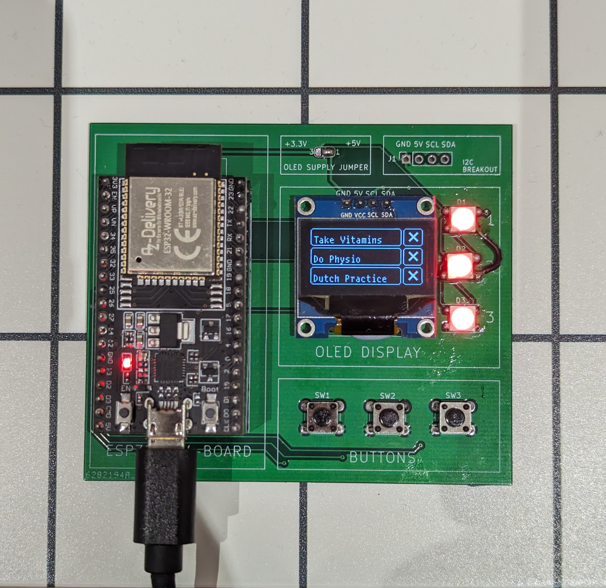
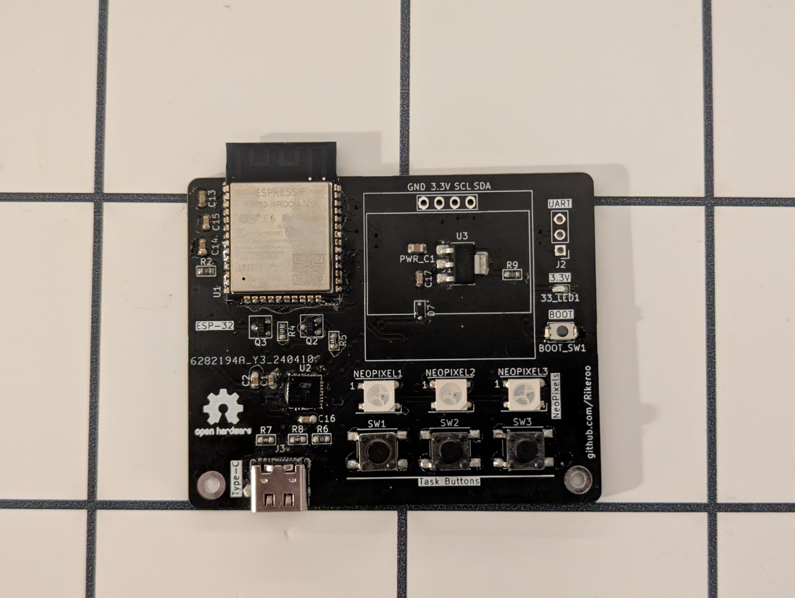
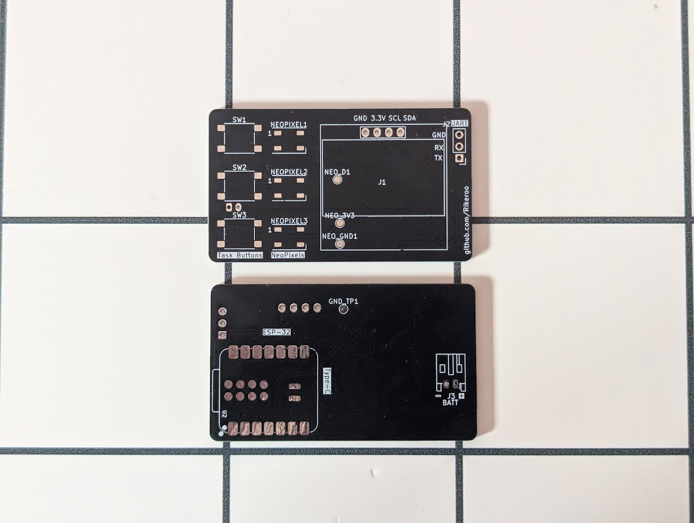
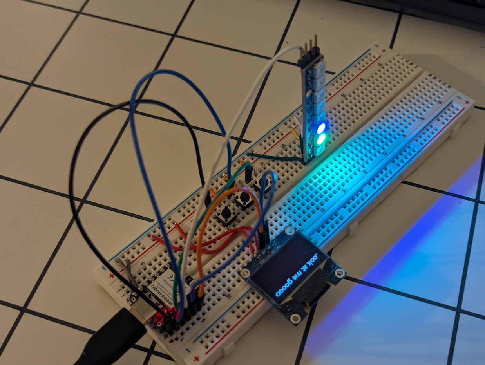

# Introduction

PCB design has been something I’ve wanted to learn for a while now, and instead of reading extensively into the topic, I thought the best way to learn was to dive into a simple project and get my hands dirty. I thought up a fairly simple concept for a ‘habit reminder' with a configurable screen to display tasks and completion status as well as satisfying tactile buttons for when the task is completed. I hoped this would provide a more constant visual reminder of tasks I wanted to complete daily, as well as the tactile buttons giving my monkey brain a sense of gratification with each task completed. Due to working with the ESP32 for various home automation and IoT related projects, I knew its capabilities with respects to WiFi and bluetooth, as well as i2c support to drive displays, so I decided to go with it.

# Breadboard Prototyping

First, to understand which GPIO pins were available for peripherals, deduce power requirements and mockup basic firmware, a basic bread-board circuit was designed, with 3 tactile buttons, a strip of NeoPixel LED modules and an OLED display hooked up via i2c. Once I had proved everything was compatible and the project was possible, I started writing some initial code for a simple UI and began work on the PCB.

# Design of PCB for use with ESP32 DevKit

I decided that to learn the KiCad design process effectively, I would first design a PCB which uses the ESP32 DevKit itself to drive the display, LEDs and take button inputs. This would mean I wouldn't have to interface with individual ICs and their required peripherals (yet) and would mean I could learn to solve common problems before attempting a more complicated PCB with the bare ESP32 S3 Module. This proved to be the right move, as once I received and populated the board, seeing all the LEDs light up and buttons move me through the menu gave me the confidence to build a more compact and complex board.

# Compact ESP32 Module Board Design

## Design

After watching some tutorials and meditating on the lessons taught a long long time ago, in a galaxy far away in my Electrical Engineering modules in years 1 and 2 of university, I built a basic schematic, with the required peripherals for the module (mostly de-coupling capacitors). After this, I decided that I didn't want to deal with turning very small buttons on and off at very precise times, so I opted for the inclusion of a USB to UART chip for easier programming and debugging. This proved more difficult than the ESP32 itself, however once the transistors controlling the reset and programming pins on the ESP32 were all wired up it made a lot more sense. 

Transferring the schematic to a PCB layout wasn't as easy as with the DevKit board, as component placement had to much more considered, with decoupling capacitors placed near relevant ICs and layout balanced between ease of routing and ergonomic design. Eventually though, I decided on a layout I was happy with, and finished the real most important part: making the silkscreen look pretty. Once I was happy with the design, I uploaded the files to a PCB manufacturing site, and started the waiting game...

## Assembly

This being the first time I had assembled a PCB with surface mount components, I was slightly daunted by the seemingly endless number of different very small, similar looking components I had to place - however little did I know, the biggest hurdle lay elsewhere: the solder paste... Me, being equal parts cheap and ignorant, thought that I could get away with not ordering a solder mask for the board "how hard can it be?" I thought. I was very wrong. In hindsight, this could have been due to the dodgy solder paste I had bought off amazon that almost certainly hadn't been stored in the conditions it was supposed to be, but putting the right amount of paste on the miniscule pads I had designed was far from the most fun I've ever had. I persevered however, and after quite a long time (and a very sore neck), I had the solder paste as close to the pads as my sanity allowed me and could start the fun bit - putting the components on! This was definitely mor enjoyable than the solder paste fiasco, and a couple of re-flow sessions later, I had my finished board.

Isn't she beautiful? I certainly thought so. "So, time to power it up, I have no doubt this will work perfectly the first time!" I thought as I excitably plugged to USB-C cable in. But alas, the electrical design gods hadn't finished their cruel games with me yet, and as soon as the plug when in, it ripped the connector and the PCB traces leading to it right off the board. Turns out in my haste, I had forgotten to solder the through-hole part of the connector - that bit which provides all the mechanical resilience to the connector. I was not best pleased at this, but decided "that was just a practice one anyway" and went through the process of creating another. This went slightly more smoothly, however I had placed too much solder paste on the pads and found many of the solder joints where getting a little too up close and personal with each other, meaning I had to use the "flux and pray" method to isolate the pads again. This worked to an extent, however at this point, I realised I had made no way of easily testing the board and was slightly over my head. 

# ESP32 C6 Speedstudio PCB

Seeing how small some of the ESP32 modules had gotten, I decided to try a board designed around of these. They had all the IO I needed, battery charging, JTAG debugging and all in a package about the same size as the ESP32 WROOM module I had been using previously. As these were ordered from China, I had a little while to wait, so I slightly bold decision to design the PCB before doing any breadboarding - my thought process being that these have become so cheap to purchase, so I may as well. I opted for placing the ESP32 module on the back of the board, allowing the front to be dedicated to the screen, buttons and LEDs.

## Breadboarding - again

To eliminate my relatively 'undeveloped' PCB design and assembly skills as a variable, I decided to breadboard the circuit first, getting peripherals such as the OLED screen and addressable LEDs working reliably first. I also decided to go a bit of a different route with the firmware, choosing to use the 'esp-idf' written in C instead of the Arduino framework. This allowed me to use freeRTOS to schedule tasks more efficiently, paving the way for lower power usage and hence the possibility of battery power.

After some patience-testing debugging of the LED strip due to odd power-up GPIO states and software based signal sending, which was rectified with use of the ESP32's Remote Control Transceiver (RMT) chip, I had some working abstractions of each peripheral, allowing me to build the main application logic.